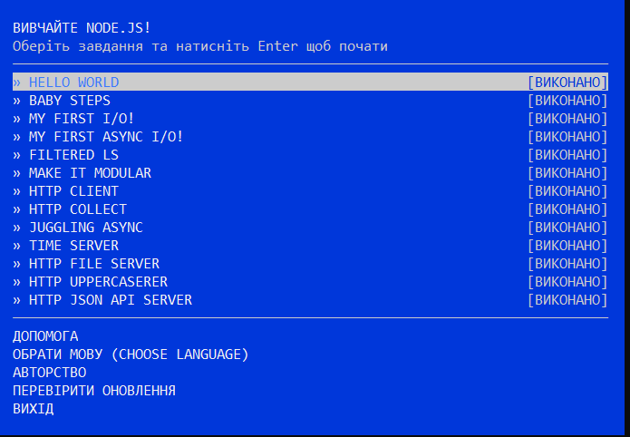
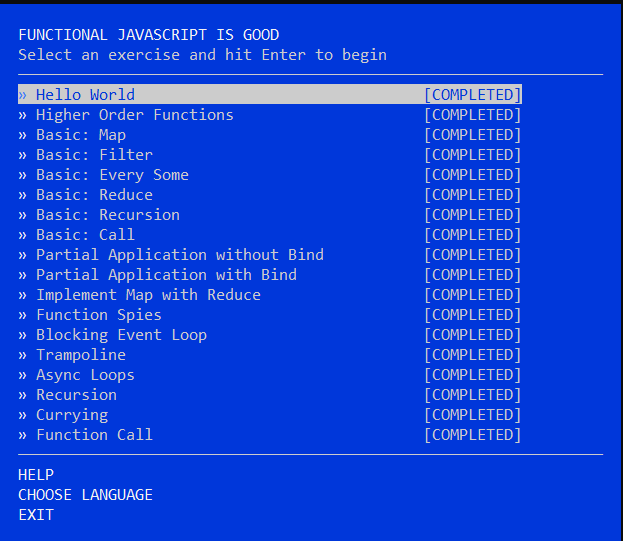
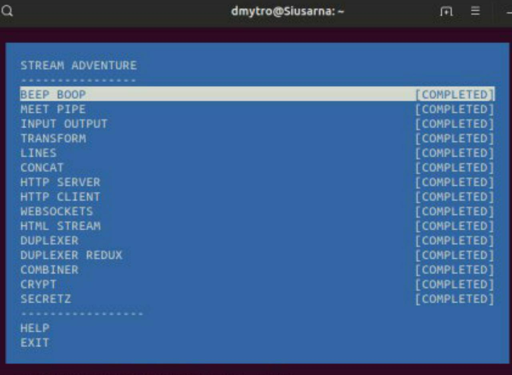

# kottans-backend
It's good opportunity to learn git very quickly
## Unix Shell

I am so happy to be able to remember all commands that I have been learning since I have entered the university.
I have discovered bash scripts and realized that scripts make work  with OS easier

## Git Collaboration

This course refresh my knowledge of Git.
Also I learn few features and believe that this git commands will save my life somewhere

## NodeJS Basics 1

This course refresh my knowledge of basic node.js;
Also I learn more about stream in js and functional programing

## Memory Management

`What's going to happen if program reaches maximum limit of stack ?`
If the maximum stack size has been reached, we have a stack overflow and the program receives a Segmentation Fault.
`What's going to happen if program requests a big (more then 128KB) memory allocation on heap ?`
The heap is enlarged via the brk() system call (implementation) to make room for the requested block.
`What's the difference between Text and Data memory segments ?`
The data segment holds the contents for static variables initialized in source code. The string lives in the text segment, which is read-only and stores all of your code in addition to tidbits like string literals.

`563e31898000-563e318c5000 r--p 00000000 08:06 2228320                    /usr/bin/bash

563e318c5000-563e31973000 r-xp 0002d000 08:06 2228320                    /usr/bin/bash

563e31973000-563e319a9000 r--p 000db000 08:06 2228320                    /usr/bin/bash

563e319a9000-563e319ad000 r--p 00110000 08:06 2228320                    /usr/bin/bash

563e319ad000-563e319b6000 rw-p 00114000 08:06 2228320                    /usr/bin/bash

563e319b6000-563e319c0000 rw-p 00000000 00:00 0

563e33358000-563e33481000 rw-p 00000000 00:00 0                          [heap]

7fd3e0edb000-7fd3e0ede000 r--p 00000000 08:06 2236802                    /usr/lib/x86_64-linux-gnu/libnss_files-2.29.so

7fd3e0ede000-7fd3e0ee5000 r-xp 00003000 08:06 2236802                    /usr/lib/x86_64-linux-gnu/libnss_files-2.29.so

7fd3e0ee5000-7fd3e0ee7000 r--p 0000a000 08:06 2236802                    /usr/lib/x86_64-linux-gnu/libnss_files-2.29.so

7fd3e0ee7000-7fd3e0ee8000 r--p 0000b000 08:06 2236802                    /usr/lib/x86_64-linux-gnu/libnss_files-2.29.so

7fd3e0ee8000-7fd3e0ee9000 rw-p 0000c000 08:06 2236802                    /usr/lib/x86_64-linux-gnu/libnss_files-2.29.so

7fd3e0ee9000-7fd3e0eef000 rw-p 00000000 00:00 0

7fd3e0f06000-7fd3e1fa2000 r--p 00000000 08:06 2235371                    /usr/lib/locale/locale-archive

7fd3e1fa2000-7fd3e1fa5000 rw-p 00000000 00:00 0

7fd3e1fa5000-7fd3e1fca000 r--p 00000000 08:06 2236055                    /usr/lib/x86_64-linux-gnu/libc-2.29.so

7fd3e1fca000-7fd3e213d000 r-xp 00025000 08:06 2236055                    /usr/lib/x86_64-linux-gnu/libc-2.29.so

7fd3e213d000-7fd3e2186000 r--p 00198000 08:06 2236055                    /usr/lib/x86_64-linux-gnu/libc-2.29.so

7fd3e2186000-7fd3e2189000 r--p 001e0000 08:06 2236055                    /usr/lib/x86_64-linux-gnu/libc-2.29.so

7fd3e2189000-7fd3e218c000 rw-p 001e3000 08:06 2236055                    /usr/lib/x86_64-linux-gnu/libc-2.29.so

7fd3e218c000-7fd3e2190000 rw-p 00000000 00:00 0

7fd3e2190000-7fd3e2191000 r--p 00000000 08:06 2236192                    /usr/lib/x86_64-linux-gnu/libdl-2.29.so

7fd3e2191000-7fd3e2193000 r-xp 00001000 08:06 2236192                    /usr/lib/x86_64-linux-gnu/libdl-2.29.so

7fd3e2193000-7fd3e2194000 r--p 00003000 08:06 2236192                    /usr/lib/x86_64-linux-gnu/libdl-2.29.so

7fd3e2194000-7fd3e2195000 r--p 00003000 08:06 2236192                    /usr/lib/x86_64-linux-gnu/libdl-2.29.so

7fd3e2195000-7fd3e2196000 rw-p 00004000 08:06 2236192                    /usr/lib/x86_64-linux-gnu/libdl-2.29.so

7fd3e2196000-7fd3e21a4000 r--p 00000000 08:06 2237150                    /usr/lib/x86_64-linux-gnu/libtinfo.so.6.1

7fd3e21a4000-7fd3e21b2000 r-xp 0000e000 08:06 2237150                    /usr/lib/x86_64-linux-gnu/libtinfo.so.6.1

7fd3e21b2000-7fd3e21bf000 r--p 0001c000 08:06 2237150                    /usr/lib/x86_64-linux-gnu/libtinfo.so.6.1

7fd3e21bf000-7fd3e21c3000 r--p 00028000 08:06 2237150                    /usr/lib/x86_64-linux-gnu/libtinfo.so.6.1

7fd3e21c3000-7fd3e21c4000 rw-p 0002c000 08:06 2237150                    /usr/lib/x86_64-linux-gnu/libtinfo.so.6.1

7fd3e21c4000-7fd3e21c6000 rw-p 00000000 00:00 0

7fd3e21d6000-7fd3e21dd000 r--s 00000000 08:06 2884993                    /usr/lib/x86_64-linux-gnu/gconv/gconv-modules.cache

7fd3e21dd000-7fd3e21de000 r--p 00000000 08:06 2235835                    /usr/lib/x86_64-linux-gnu/ld-2.29.so

7fd3e21de000-7fd3e21ff000 r-xp 00001000 08:06 2235835                    /usr/lib/x86_64-linux-gnu/ld-2.29.so

7fd3e21ff000-7fd3e2207000 r--p 00022000 08:06 2235835                    /usr/lib/x86_64-linux-gnu/ld-2.29.so

7fd3e2207000-7fd3e2208000 r--p 00029000 08:06 2235835                    /usr/lib/x86_64-linux-gnu/ld-2.29.so

7fd3e2208000-7fd3e2209000 rw-p 0002a000 08:06 2235835                    /usr/lib/x86_64-linux-gnu/ld-2.29.so

7fd3e2209000-7fd3e220a000 rw-p 00000000 00:00 0

7fffbf055000-7fffbf076000 rw-p 00000000 00:00 0                          [stack]

7fffbf098000-7fffbf09b000 r--p 00000000 00:00 0                          [vvar]

7fffbf09b000-7fffbf09c000 r-xp 00000000 00:00 0                          [vdso]

ffffffffff600000-ffffffffff601000 r-xp 00000000 00:00 0                  [vsyscall]`

Heap - 563e33358000-563e33481000

Stack - 7fffbf055000-7fffbf076000

MMS - 7fd3e0ede000-7fd3e0ee5000

This subtasks open for me anatomy of a program in memory, its was hard but I understood stack, heap, garbage collector.
